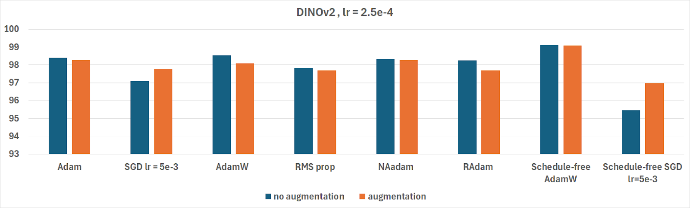
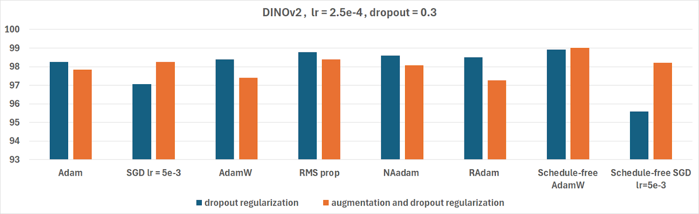
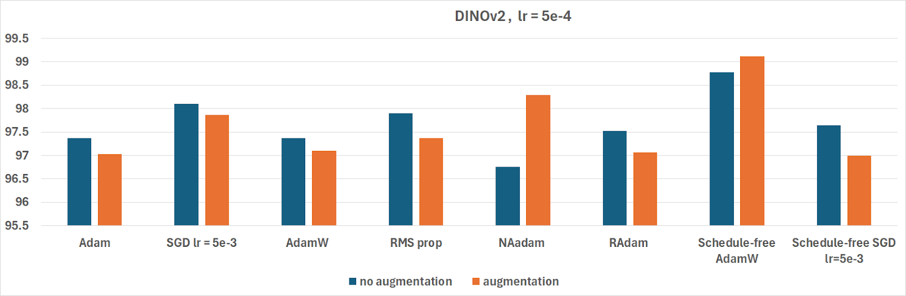
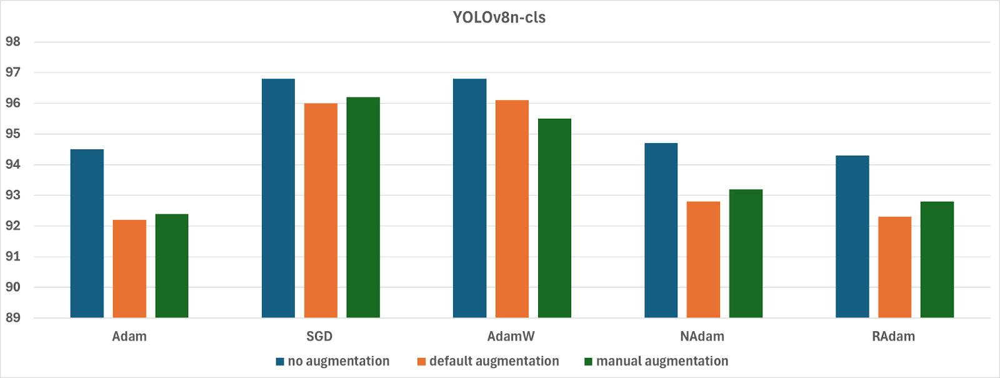
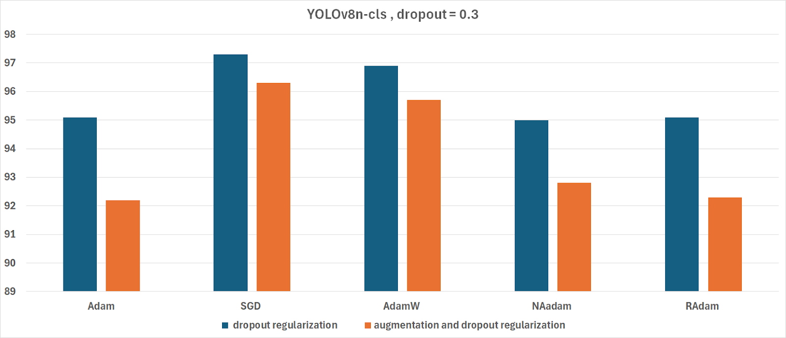
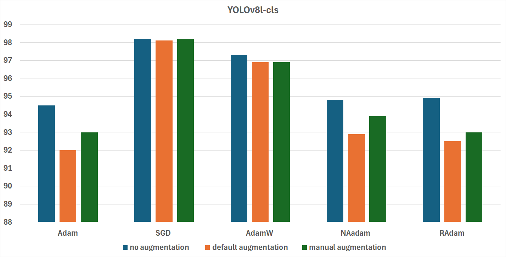

# Optimizing Bird Species Classification- Self-Supervised vs. Supervised Models
<a href="https://github.com/dordanin">Dor Danino</a>, <a href="https://github.com/TalPol">Tal Polak</a> - Spring 2024

Optimizing Bird Species Classification- Self-Supervised vs. Supervised Models
# Project documentation
## Topics
* Introduction
* Method
* Results
* Conclusions
* How to run
* Ethics Statement

## Introduction
This project aims to compare the performance of self-supervised and supervised models across different optimizers for fine-grained image classification, with a particular focus on distinguishing between similar bird species. By leveraging transfer learning, we can utilize new pre-trained models and cutting-edge optimizers to achieve high accuracy in classifying these closely related species. This project and the dataset used are both publicly available.
## Motivation
We undertook this project to explore which model, DINOv2 (a self-supervised model) or YOLOv8 (a supervised model), performs better in fine-grained image classification, while testing which optimizers gave the best result.
Previous Works
Prior works have created a great deal of models designed for this particular dataset. In particular, Bird Detection and Species Classification: Using YOLOv5 and Deep Transfer Learning Models compared the performance of YOLOv5, VGG19, InceptionV3, and EfficientNetB3, using optimizers such as AdamW, SGD, and AdamMax.
However, works measuring the performance of newer models, such as DINOv2 and YOLOv8, do not currently exist.
# Method
In this section we’ll discuss the models, training, optimizers,  and hyperparameters.
## DINOv2 
DINOv2 (self-DIstillation with NO labels v2) is an open-source self-supervised framework that leverages Vision Transformers. Developed by researchers at Meta, it was trained on 142 million unlabeled images. We used the DINOv2 large image classification model, which contains 300 million parameters, as a feature extractor and trained the last layer as a classification layer. Using this model, we trained a total of 57 different models, each utilizing a unique combination of parameters, optimizers, or augmentations.
Each one of the models was trained with one of the following optimizers: SGD, Adam, AdamW, RMSProp, AdamN, AdamR, schedule free AdamW and, schedule free SGD. For each optimizer at least six models were trained, all training for 3 epochs.
All optimizers used their default settings, excluding the learning rate.

The following sets of parameters were used to create the models:

1. Learning rate of 2.5e-4, batch size of 256, no augmentations with full precision.
2. Learning rate of 2.5e-4, batch size of 128, kornia augmentations, and automatic mixed precision.
3. Learning rate of 2.5e-4, batch size of 256, dropout rate of 0.3, no augmentations, and automatic mixed precision.
4. Learning rate of 2.5e-4, batch size of 64, dropout rate of 0.3, kornia augmentations, and automatic mixed precision.
5. Learning rate of 5e-4, batch size of 128, no augmentations, and automatic mixed precision.
6. Learning rate of 5e-4, batch size of 128,  kornia augmentations, and automatic mixed precision.

The kornia augmentations used were:
* RandomRotation of up to 45 degrees with a probability of 0.3.
* RandomHorizantalFlip with a probability of 0.3.
* RandomVerticalFlip with a probability of 0.3.
* RandomAffine of up to 30 degrees with a probability of 0.3.


## YOLOv8
YOLOv8 is the eighth version of YOLO (You Only Look Once), an open-source state-of-the-art model designed by Ultralytics. It is built on a CNN architecture and is tailored for various tasks, including object detection and tracking, instance segmentation, image classification, and pose estimation. The YOLOv8 image classification models were all trained on the ImageNet dataset, which contains over 14 million images across 1000 classes. We mainly used the YOLOv8n-cls model which has 2.7 million parameters, but we also tested the YOLOv8l-cls model which has 37.5 million parameters. Using transfer learning, we fine-tuned the models and created 54 different models, each using a different combination of parameters, optimizers, and augmentations.
Each one of the models was trained with one of the following optimizers: SGD, Adam, AdamW, RMSProp, AdamN, and AdamR. For each optimizer, at least 8 models were trained all training for 10 epochs. The models were trained using the Ultralytics library, using mainly the default settings, aside from those that were changed as parameters.

The following sets of parameters were used to create the models:
1. Default learning rate and momentum, no augmentations using the YOLOv8n-cls model.
2. Default learning rate and momentum, default augmentations using the YOLOv8n-cls model.
3. Default learning rate and momentum, manual augmentations using the YOLOv8n-cls model.
4. Default learning rate and momentum, no augmentations, dropout of 0.3 using the YOLOv8n-cls model.
5. Default learning rate and momentum, default augmentations, dropout of 0.3 using the YOLOv8n-cls model.
6. Default learning rate and momentum, no augmentations using the YOLOv8l-cls model.
7. Default learning rate and momentum, default augmentations using the YOLOv8l-cls model.
8. Default learning rate and momentum, manual augmentations using the YOLOv8l-cls model.


# Results
## DINOv2 Results
DINOv2 learning rate =  2.5e-4  


  
DINOv2 learning rate =  2.5e-4 with dropout = 0.3 
 * Dropout: Slight negative effect on accuracy; results consistent with first figure
   


   
DINOv2 learning rate =  5e-4 
 * Increased Learning Rate: Higher learning rates (5e-4) reduced accuracy
   



Summary:
 * Best Performance: Schedule-free AdamW with >99% validation accuracy.
 * Effectiveness of AMP and Augmentations: Limited negative impact.
 * Overall Performance: Most models achieved 95%+ validation accuracy

## YOLOv8  Results
* SGD Optimizer: Best performance across all parameter sets on this dataset.
* YOLOv8l-cls vs YOLOv8n-cls did not outperform except when using SGD.
* RMSProp:
  * Performed poorly, with a maximum validation accuracy of only 43.6%.
  * Most models failed to exceed 1% accuracy, even with 12 additional attempts.
  * Likely unsuitable for YOLO or a possible implementation issue. 
* Augmentations:		
  * Models without augmentations performed better than those with.
  * Default augmentations in YOLO reduced accuracy due to image erasure.
    





# Conclusions
DINOv2, a self-supervised learning model, achieved outstanding results, with the Schedule-free AdamW optimizer leading to a final accuracy exceeding 99%. This highlights the potential of self-supervised models in tasks requiring intricate feature extraction. The YOLOv8 model, while traditionally optimized for object detection, was fine-tuned for classification in this project. The model performed well using SGD as the optimizer, though it did not reach the accuracy levels achieved by DINOv2.

Our findings demonstrated the significant impact of augmentation techniques on the YOLOv8 model, where custom augmentations outperformed default settings. However, augmentation did not influence the performance of DINOv2 as strongly, likely due to its robust pre-training process. We also found that certain augmentations, such as erasing, could adversely affect the model by removing critical features from the images, especially for tasks requiring fine-grained detail.

In future work, further exploration into the performance of additional optimizers for YOLOv8 could provide more insights. Additionally, the inclusion of other self-supervised learning models, or hybrid methods combining both self-supervised and supervised learning techniques, could yield even more promising results for fine-grained classification.

Overall, this study underscores the strengths of both DINOv2 and YOLOv8, while also highlighting the importance of tailoring training strategies to specific model architectures and tasks.

 
 ## Prerequisites

| Library                  | Why                                                             |
|--------------------------|-----------------------------------------------------------------|
| `matplotlib`             | Plotting and visualization                                      |
| `time`                   | Time-related functions                                          |
| `os`                     | Operating system interface                                      |
| `copy`                   | Shallow and deep copy operations                                |
| `PIL`                    | Python Imaging Library for image processing                     |
| `cv2`                    | OpenCV library for computer vision tasks                        |
| `pandas`                 | Data manipulation and analysis                                  |
| `torch`                  | Deep learning framework                                         |
| `torchvision`            | Datasets and transformations for vision tasks                   |
| `kornia`                 | Differentiable computer vision library for PyTorch              |
| `tqdm`       			   | A fast, extensible progress bar for python						 |
| `xformers`               | Toolbox to Accelerate Research on Transformers                  |
| `ultralytics`            | Package for the YOLOv8 model                                    |
| `schedulefree`           | Package for Schedule-free optimizers                            |


## Datasets
| Dataset           | Notes                         | Link                                                                                							|
|-------------------|------------------------------------|----------------------------------------------------------------------------------------------------------|
| BIRDS 525 SPECIES- IMAGE CLASSIFICATION  | The dataset is not available in this repository, please download it from the link | [Kaggle](https://www.kaggle.com/datasets/gpiosenka/100-bird-species/) |

## Repository Organization

| Directory name                                            | Content                                                                                				|
|------------------------------------------------------|------------------------------------------------------------------------------------------------------------|
| `/assets`                                            | directory for assets (images, etc.)                       			           				 				|
| `/docs`                                              | various documentation files                                                                 				|
| `/notebooks`                                         | Jupyter Notebooks used for training and evaluation                                          				|
| `/models`                                            | folder for saved models using .pth files, due to space constraints we couldn't put any of our models there |
| `/dataset`                                           | directory for the dataset                                                                   				|
| `requirements.txt`                                   | requirements file for `pip`                                                                 				|

## Notebooks list
See list of sets above at DINOv2 and YOLOv8 sections.

| File name                                            | Content                                                                                     				|
|------------------------------------------------------|------------------------------------------------------------------------------------------------------------|
| `/notebooks/Dino_lr2.5e-4.ipnyb`                     | notebook for first and second DINOv2 model sets                                             				|
| `/notebooks/Dino_lr2.5e-4_dropout.ipnyb`             | notebook for third and fourth DINOv2 model sets                                             				|
| `/notebooks/Dino_lr5e-4.ipnyb`                       | notebook for fifth and sixth DINOv2 model sets                                              				|
| `/notebooks/YOLOv8n.ipnyb`                           | notebook for first, second and third YOLOv8 model sets                                     				|
| `/notebooks/YOLOv8n_dropout.ipnyb`                   | notebook for fourth and fifth YOLOv8 model sets                                             				|
| `/notebooks/YOLOv8l.ipnyb`                           | notebook for sixth, seventh and eighth YOLOv8 model sets                                    				|

# How to run
1) Clone the git repository.
2) Use the environment file to create an environment with the required packages:
	```bash
    conda env create -f environment.yml
    ```
	And activate the environment using:
	```bash
	conda activate optimizing_bird_classification
	```
3) Download the data set: https://www.kaggle.com/datasets/gpiosenka/100-bird-species/data, and extract the files in the `/dataset/` folders.
4) IMPORTANT: Rename the valid directory to val, i.e., change "./dataset/valid" to "./dataset/val".
5) Use the provided notebooks.
NOTE: Due to space constraints we couldn't put any of our models in the repository, so you'll have to train your own models. 

# Ethics Statement

stakeholders that will be affected by the project:
* Data Scientists/Researchers - who are developing and testing models for fine-grained image classification.
* Conservationists/Bird Enthusiasts - who are interested in species identification for conservation or ecological research.
* Technology Companies - that can integrate this classification technology into applications such as wildlife monitoring or mobile applications.
  
The explanation that is given to each stakeholder:
* Data Scientists/Researchers: This project explores the effectiveness of self-supervised models like DINOv2 and supervised models like YOLOv8 for bird species classification, offering insights into the performance of various optimizers. These findings can help guide the selection of model architectures and optimizers for future classification tasks.
* Conservationists/Bird Enthusiasts: This technology allows accurate identification of bird species, even those that look similar, by training AI models on a large dataset of bird images. It could assist in ecological research and help track bird populations for conservation efforts.
* Technology Companies: The models developed in this project could be used to improve wildlife tracking and monitoring systems or be integrated into consumer-facing applications like mobile apps for bird watching, offering accurate, real-time species identification.


# References

[1] BIRDS 525 data set: https://www.kaggle.com/datasets/gpiosenka/100-bird-species/data

[2] DINOv2 Github: https://github.com/facebookresearch/dinov2

[3] YOLO v8: https://docs.ultralytics.com/models/yolov8/ 

[4] Aaron Defazio and Xingyu Alice Yang and Harsh Mehta and Konstantin Mishchenko and Ahmed Khaled and Ashok Cutkosky. The Road Less Scheduled. https://arxiv.org/abs/2405.15682 
